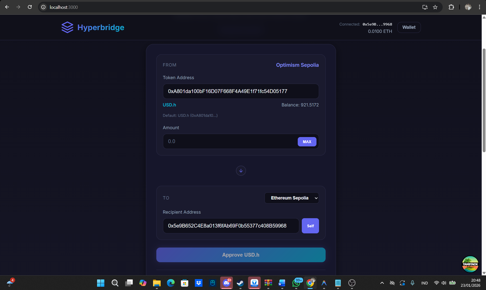

# Hyperbridge Token Bridge (Frontend)

This is the Frontend application for the **Hyperbridge Token Bridge** challenge. It is built with **React**, **Vem**, **Wagmi**, and **TanStack Router**, providing a user-friendly interface to bridge tokens across chains using the Hyperbridge protocol.

## ✨ Features

- **Connect Wallet**: Integrated with Reown AppKit (WalletConnect).
- **Bridge Interface**:
  - Source Chain: **Optimism Sepolia**
  - Destination Chains: **Ethereum Sepolia**, **Base Sepolia**, **Arbitrum Sepolia**
  - Token: **USD.h** (Hyper USD)
- **Automatic Fee Handling**: Interacts with the wrapper contract to handle relayer fees transparently.
- **Cross-Chain Balances**: Real-time display of your USD.h balances on all supported destination chains to verify successful bridging.
- **Transaction Tracking**: Links to block explorers for tracking bridge status.

## 🚀 Getting Started

### Prerequisites
- Node.js >= 18
- Bun (recommended) or npm/yarn

### Installation

```bash
bun install
```

### Run Locally

```bash
bun run dev
```
The app will be available at `http://localhost:5173`.

## 📖 Usage Guide

1. **Connect Wallet**: Click the "Connect Wallet" button and select your wallet (e.g., MetaMask).
2. **Switch Network**: Ensure you are connected to **Optimism Sepolia**. The app will prompt you to switch if needed.
3. **Get Test Tokens**:
   - Use the "TokenFaucet" link at the bottom of the form to mint test USD.h tokens.
4. **Bridge Tokens**:
   - Enter the amount of USD.h to bridge.
   - Select the Destination Chain (e.g., Ethereum Sepolia).
   - Click **Approve** (if necessary) and sign the transaction.
   - Click **Bridge** and confirm the transaction.
5. **Wait & Verify**:
   - The bridge process typically takes **2-5 minutes**.
   - Watch the **"Your Balances on Destination Chains"** section. The balance for the target chain will update automatically once the tokens arrive.

## 📺 Demo & Screenshots

### Video Walkthrough
[](https://youtu.be/taGqbYN6tnE)

### Application Screenshot


## 🔧 Configuration

Key configuration files:
- `src/config/wagmi.ts`: Chain configurations and contract addresses.
- `src/hooks/useBridge.ts`: Main logic for bridging interactions.
- `src/components/BridgeForm.tsx`: The main UI component.

## 📦 Dependencies

- **Viem / Wagmi**: For blockchain interactions.
- **@reown/appkit**: For wallet connection.
- **Lucide React**: for icons.
- **TanStack Router**: For client-side routing.
